# C++20 2D RPG Engine — System Design Document

## 1. Executive Summary

This document describes the architecture and implementation plan for a modular C++20 2D game engine focused on RPG-style games similar in structure to *EarthBound*, *RPG Maker*, classic SNES/GBA RPGs, and tile-based adventure games.

The engine is designed to support:

* 2D tile-based worlds
* Sprite rendering
* Scene editing
* Lua scripting
* Cross-platform builds for Windows and Linux
* Steam-friendly distribution
* Clean CMake-based project architecture
* Development of a real game alongside the engine
* Reuse by other developers beyond the original author

The engine should be small enough to complete realistically, but structured enough to grow into a serious toolchain for shipping full games.

---

## 2. Product Goals

### 2.1 Primary Goals

The engine should allow a developer to create, edit, package, and ship a complete 2D RPG-style game.

The intended workflow is:

1. Build engine systems in C++.
2. Build gameplay logic in Lua.
3. Create maps, entities, and scenes in an editor.
4. Test the game continuously while developing the engine.
5. Package the final game for Windows and Linux.
6. Publish the game on Steam or share it directly.

### 2.2 Non-Goals

The engine is not intended to be a general-purpose 3D engine.

It is also not trying to compete with Unity, Godot, Unreal, or RPG Maker feature-for-feature.

The engine should avoid:

* Full 3D rendering
* Visual scripting in the first version
* Multiplayer networking in the first version
* Physics simulation beyond simple 2D collision
* Complex animation graphs
* A plugin marketplace
* A full IDE-like editor

The initial goal is a focused, pleasant, hackable 2D RPG engine.

---

## 3. Design Philosophy

The core philosophy is:

> The engine provides capability.
> The game provides behavior.
> The editor provides tooling.

This separation keeps the codebase maintainable and prevents the engine from becoming tangled with a single game.

### 3.1 Major Architectural Principles

* Engine code must be reusable.
* Game-specific logic must not leak into engine modules.
* The editor must be optional and separate from runtime.
* Lua should own gameplay behavior.
* C++ should own performance-critical and platform-level systems.
* Data should live in assets and scene files, not hardcoded C++.
* The build system should be understandable and modular.
* The engine should be developed through vertical game slices.

---

## 4. High-Level Architecture

The engine consists of several modular C++ libraries, one editor executable, and one or more game executables.

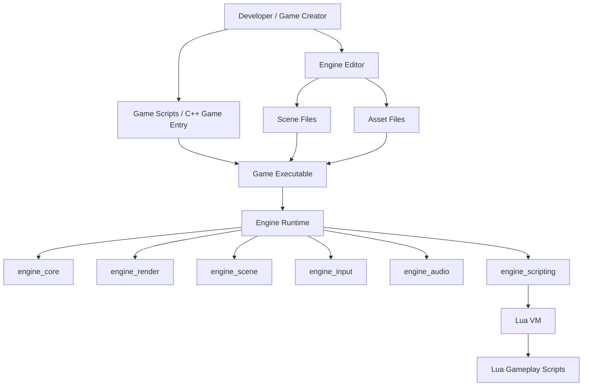

---

## 5. Repository Layout

The repository should be organized to clearly separate engine code, tooling, game code, documentation, and tests.

```text
/engine-root
  /cmake
  /external
  /docs
  /include
  /src
    /core
    /render
    /scene
    /input
    /audio
    /assets
    /scripting
    /runtime
    /editor
  /tools
    /asset_packer
    /project_generator
  /games
    /my_rpg
      /assets
      /scripts
      /scenes
      /src
  /tests
  CMakeLists.txt
  CMakePresets.json
```

### 5.1 Directory Responsibility Diagram

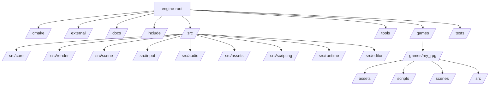

---

## 6. CMake Architecture

The build system should model the architecture directly. Each engine module should be its own target. The editor and game executables should link against the engine libraries they need.

### 6.1 CMake Targets

Recommended initial targets:

```text
engine_core          static library
engine_math          static library
engine_assets        static library
engine_render        static library
engine_input         static library
engine_audio         static library
engine_scene         static library
engine_scripting     static library
engine_runtime       static library
engine_editor        executable
game_my_rpg          executable
asset_packer         executable
```

### 6.2 Target Dependency Graph

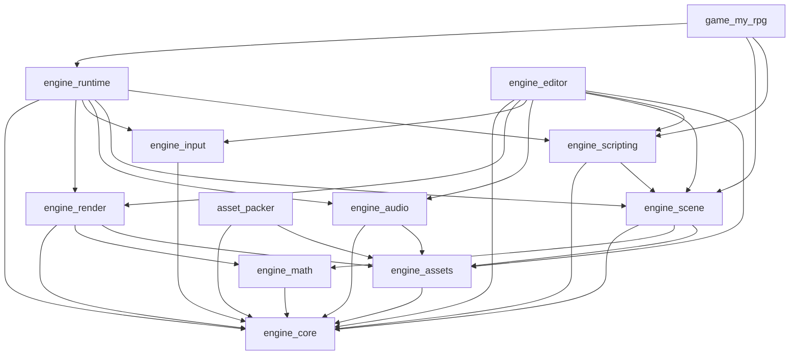

### 6.3 Dependency Rules

The following dependency rules should be enforced:

```text
Allowed:
  game -> engine
  editor -> engine
  tools -> engine
  engine_runtime -> engine modules

Forbidden:
  engine -> game
  engine -> editor
  engine_core -> render/input/audio/scene/scripting
  editor -> game-specific logic
```

### 6.4 Suggested Build Presets

Use `CMakePresets.json` for predictable builds.

Recommended presets:

```text
debug-windows
release-windows
debug-linux
release-linux
```

A typical build flow:

```bash
cmake --preset debug-linux
cmake --build --preset debug-linux
```

---

## 7. Engine Module Design

## 7.1 engine_core

`engine_core` contains low-level infrastructure used by every other module.

### Responsibilities

* Logging
* Assertions
* Filesystem utilities
* Application paths
* Platform detection
* Time utilities
* Error handling
* Result types
* Basic service lifecycle primitives

### Example Types

```cpp
namespace Engine::Core
{
    class Logger;
    class FileSystem;
    class Clock;
    class EngineError;
    template <typename T>
    class Result;
}
```

### Non-Responsibilities

`engine_core` should not contain:

* Rendering
* Audio
* Input
* Scene logic
* Lua logic
* Game-specific logic

This module should remain boring and extremely stable.

---

## 7.2 engine_math

`engine_math` contains lightweight math types useful across the engine.

### Responsibilities

* Vectors
* Rectangles
* Matrices if needed
* Colors
* Interpolation helpers
* Coordinate conversion helpers

### Example Types

```cpp
namespace Engine::Math
{
    struct Vec2;
    struct IVec2;
    struct Rect;
    struct Color;
}
```

For a 2D RPG engine, this should remain simple. Avoid turning this into a massive math library unless the engine needs it.

---

## 7.3 engine_assets

`engine_assets` owns asset discovery, loading, caching, and metadata.

### Responsibilities

* Asset registry
* Asset handles
* Texture asset metadata
* Audio asset metadata
* Script asset metadata
* Scene asset metadata
* Asset path resolution
* Optional packed asset loading later

### Asset Identity

Assets should eventually use stable IDs rather than only raw file paths.

For early development, paths are acceptable:

```json
{
  "texture": "assets/characters/player.png"
}
```

Later, this can evolve into GUID-backed metadata:

```json
{
  "texture": "asset://8f6e4ac2-20f2-41bb-b221-2e51e1e83342"
}
```

### Asset Loading Flow

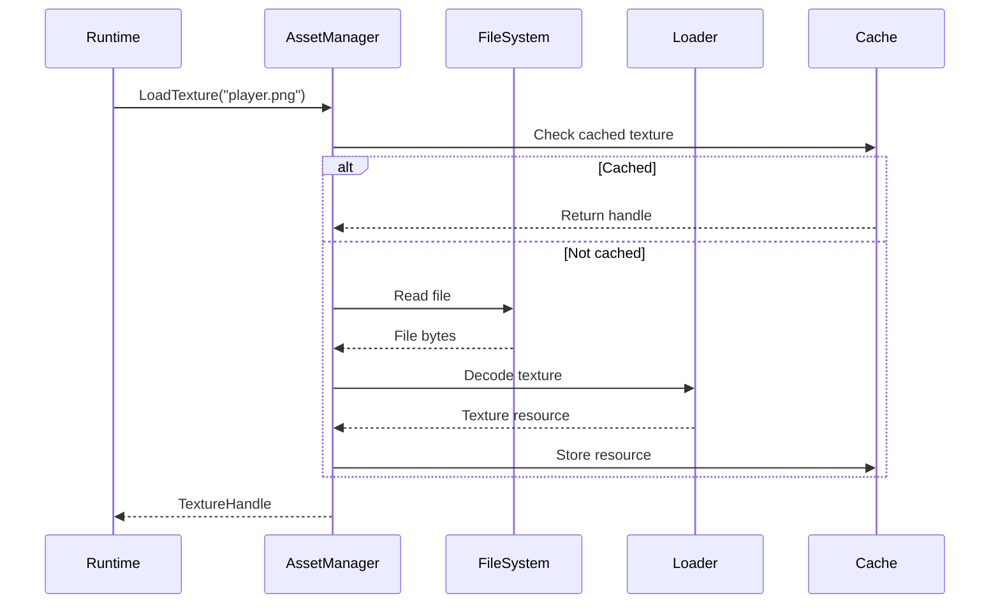

---

## 7.4 engine_render

`engine_render` owns drawing.

### Initial Rendering Scope

The first version should support:

* Window-backed rendering
* Texture loading
* Sprite drawing
* Tilemap drawing
* Camera transforms
* Basic batching later
* Pixel-perfect scaling options

### Rendering Backend

The recommended first implementation is SDL2 rendering or SDL3 rendering, depending on chosen dependency version.

A later renderer abstraction can support OpenGL, Vulkan, or other backends, but that should not block the first playable game.

### Renderer Architecture

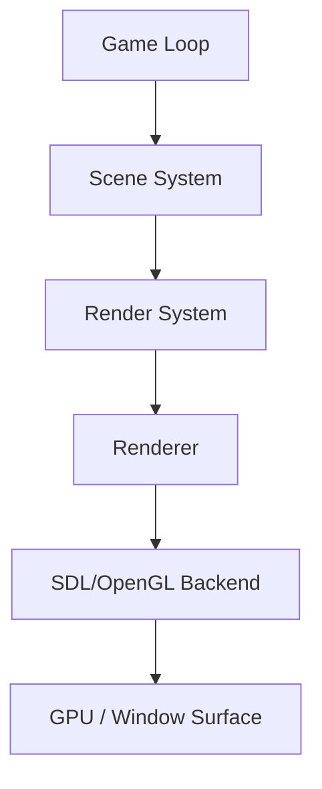

### Example Types

```cpp
namespace Engine::Render
{
    class Renderer;
    class Texture;
    class TextureHandle;
    class Sprite;
    class Camera2D;
    class RenderCommandQueue;
}
```

### Render Commands

Eventually the scene can produce render commands:

```cpp
struct DrawSpriteCommand
{
    TextureHandle texture;
    Rect sourceRect;
    Vec2 position;
    Vec2 scale;
    float rotation;
    int sortOrder;
};
```

This makes rendering easier to batch and sort.

---

## 7.5 engine_input

`engine_input` owns keyboard, mouse, and controller input.

### Responsibilities

* Poll raw input
* Map raw input to actions
* Support pressed, held, and released states
* Support remapping later

### Input Model

The game should not ask directly whether `W` is pressed.

Instead, it should ask whether an action is active:

```cpp
Input::IsHeld("MoveUp");
Input::IsPressed("Confirm");
```

This allows keyboard and controller mappings to change without rewriting gameplay code.

### Input Flow

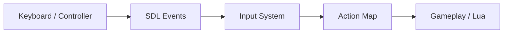

---

## 7.6 engine_audio

`engine_audio` owns sound and music playback.

### Responsibilities

* Load sound effects
* Play one-shot sound effects
* Play looping music
* Stop/pause/resume music
* Volume controls

### Audio API

C++:

```cpp
Audio::PlaySound("assets/audio/ui_confirm.wav");
Audio::PlayMusic("assets/audio/field_theme.ogg");
```

Lua:

```lua
Audio:PlaySound("ui_confirm")
Audio:PlayMusic("field_theme")
```

---

## 7.7 engine_scene

`engine_scene` owns the world model.

### Responsibilities

* Scene loading
* Scene saving
* Entity creation/destruction
* Component storage
* Tilemap data
* Runtime scene update
* Serialization/deserialization

### Entity Model

The engine can use an ECS-like architecture without needing a fully generic ECS initially.

Recommended starting model:

```cpp
class Entity
{
public:
    EntityId Id() const;
    std::string_view Name() const;

    template <typename T>
    T* GetComponent();

    template <typename T>
    T& AddComponent(T component);
};
```

### Initial Components

```text
TransformComponent
SpriteComponent
AnimatedSpriteComponent
TilemapComponent
ColliderComponent
ScriptComponent
CameraComponent
AudioSourceComponent
InteractableComponent
```

### Scene System Diagram

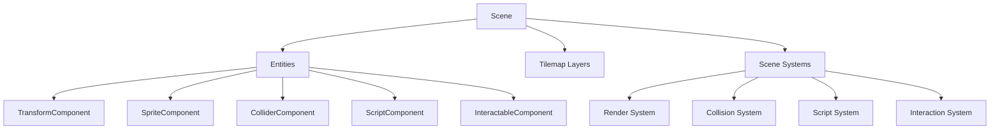

---

## 7.8 engine_scripting

`engine_scripting` embeds Lua and exposes a safe gameplay API.

### Responsibilities

* Create and manage Lua VM
* Load Lua scripts
* Bind engine APIs
* Attach Lua scripts to entities
* Call lifecycle methods
* Support hot reload in development

### Script Lifecycle

Lua scripts should support lifecycle functions:

```lua
function OnCreate()
end

function OnUpdate(deltaTime)
end

function OnInteract(otherEntity)
end

function OnDestroy()
end
```

### Lua Binding Boundary

Lua should not access arbitrary C++ internals.

Lua should access a curated API:

```text
Entity
Scene
Input
Audio
Dialogue
Time
```

### Lua Execution Flow

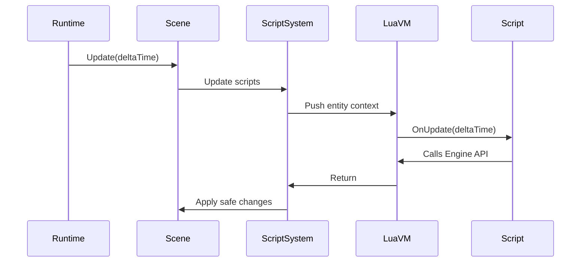

### Example Script

```lua
function OnCreate()
    print("NPC created")
end

function OnInteract(other)
    Dialogue:Show("Hello there!")
end
```

---

## 7.9 engine_runtime

`engine_runtime` ties all core runtime systems together.

### Responsibilities

* Initialize engine systems
* Own main game loop
* Manage application lifecycle
* Load initial scene
* Coordinate update and render phases
* Shutdown cleanly

### Runtime Loop

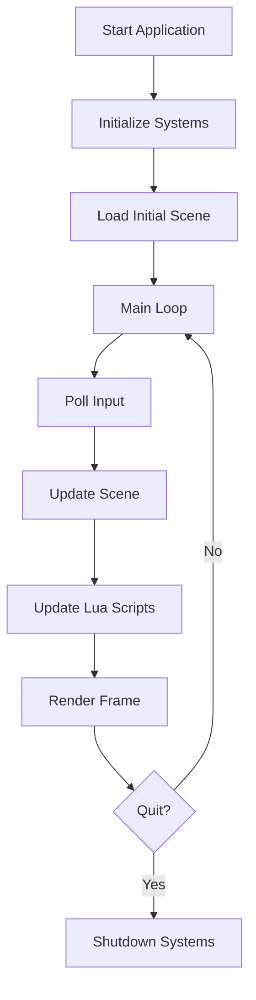

### Fixed Update vs Variable Update

For an RPG-style engine, the runtime can support:

* Variable update for simple gameplay
* Fixed update for collision/movement determinism later

Recommended initial implementation:

```text
Poll input
Update with delta time
Render
```

Later:

```text
Poll input
Run fixed update zero or more times
Render interpolated state
```

---

## 8. Editor Architecture

The editor is a separate executable that edits project data.

It should not be required by the shipped game.

### 8.1 Editor Responsibilities

The editor should eventually support:

* Project opening
* Asset browsing
* Scene hierarchy
* Entity inspector
* Component editing
* Tilemap painting
* Collision layer editing
* Script attachment
* Scene save/load
* Game preview or launch

### 8.2 Editor v1 Scope

The first editor should be intentionally small.

Editor v1 should include:

* Open scene
* Save scene
* View hierarchy
* Select entity
* Edit transform
* Paint tilemap
* Attach sprite
* Attach script path

### 8.3 Editor Layout

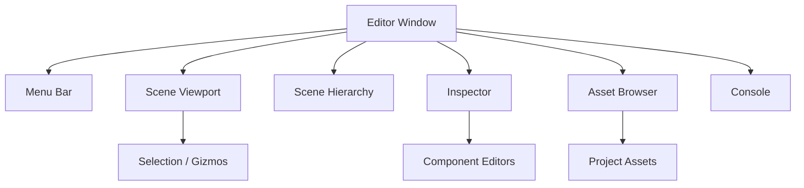

### 8.4 Editor and Runtime Relationship

The editor writes the same scene files that the runtime reads.

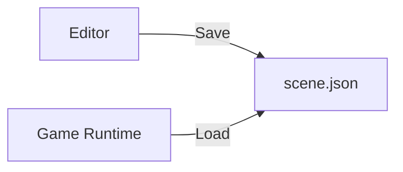

This avoids needing play-in-editor immediately.

The editor can later add a play mode, but early development should keep the editor as a data-authoring tool.

---

## 9. Scene File Format

Scenes should be serialized in a human-readable format during development.

JSON is a practical starting point.

### 9.1 Example Scene

```json
{
  "version": 1,
  "name": "starter_town",
  "entities": [
    {
      "id": "player_spawn",
      "name": "PlayerSpawn",
      "components": {
        "Transform": {
          "position": { "x": 128, "y": 192 },
          "rotation": 0,
          "scale": { "x": 1, "y": 1 }
        }
      }
    },
    {
      "id": "npc_001",
      "name": "Town NPC",
      "components": {
        "Transform": {
          "position": { "x": 240, "y": 160 },
          "rotation": 0,
          "scale": { "x": 1, "y": 1 }
        },
        "Sprite": {
          "texture": "assets/characters/npc_001.png",
          "sourceRect": { "x": 0, "y": 0, "w": 32, "h": 32 }
        },
        "Script": {
          "path": "scripts/npc/town_npc.lua"
        },
        "Interactable": {
          "radius": 24
        }
      }
    }
  ],
  "tilemaps": [
    {
      "name": "Ground",
      "tileset": "assets/tilesets/town.png",
      "tileWidth": 16,
      "tileHeight": 16,
      "width": 64,
      "height": 64,
      "data": []
    }
  ]
}
```

### 9.2 Versioning

Every serialized asset should include a version:

```json
{
  "version": 1
}
```

This makes future migrations possible.

---

## 10. Tilemap System

Tilemaps are core to the engine.

### 10.1 Requirements

The tilemap system should support:

* Multiple tile layers
* Tileset texture references
* Collision layers
* Visibility toggles
* Z-order/sort order
* Tile painting in editor
* Efficient rendering

### 10.2 Tilemap Data Model

```cpp
struct Tile
{
    int tileId;
    bool solid;
};

struct TileLayer
{
    std::string name;
    int width;
    int height;
    std::vector<Tile> tiles;
    bool visible;
    int sortOrder;
};
```

### 10.3 Tilemap Rendering Flow

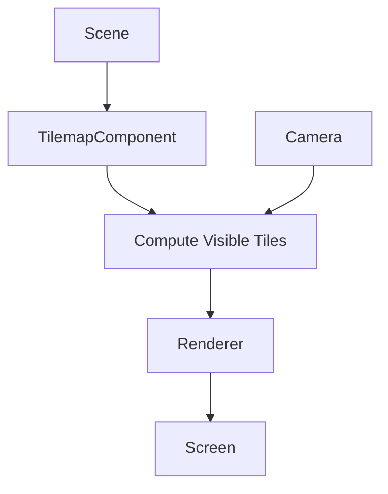

The renderer should only draw tiles visible to the camera.

This matters once maps become large.

---

## 11. Collision and Interaction

The first collision system should be simple.

### 11.1 Collision Goals

Support:

* Tile collision
* Entity AABB collision
* Trigger zones
* Interactable entities

Avoid complex physics in the first version.

### 11.2 Collision Flow

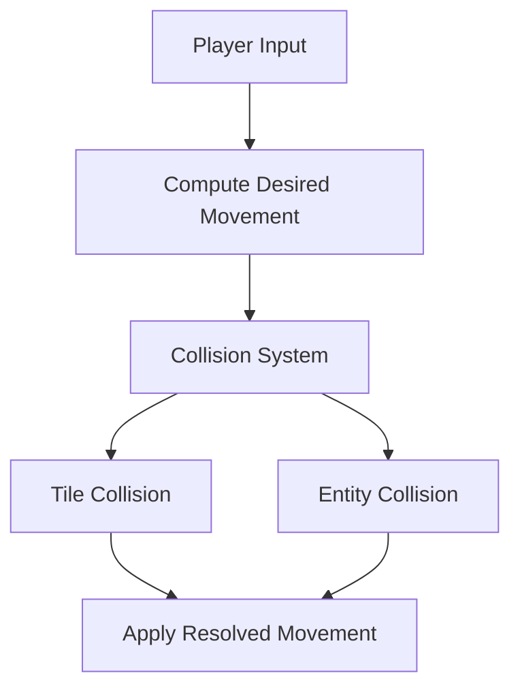

### 11.3 Interaction Flow

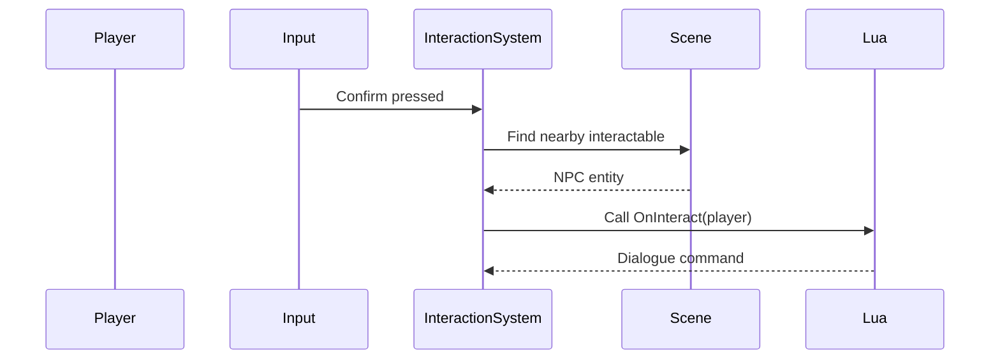

---

## 12. Dialogue System

A 2D RPG engine needs a built-in dialogue system.

### 12.1 Requirements

Support:

* Text boxes
* Typewriter effect
* Speaker names
* Portraits later
* Choices later
* Lua-triggered dialogue

### 12.2 Dialogue API

Lua:

```lua
Dialogue:Show("Hello, welcome to town!")
```

Future:

```lua
Dialogue:Show({
    speaker = "Mina",
    text = "Have you seen the stars tonight?",
    portrait = "assets/portraits/mina.png"
})
```

### 12.3 Dialogue Flow

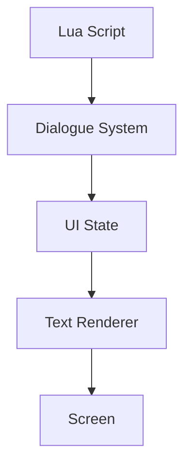

---

## 13. Lua Scripting Design

Lua scripting is central to the engine.

### 13.1 Why Lua?

Lua is lightweight, embeddable, fast, and commonly used for game scripting.

It allows game behavior to change without recompiling the engine.

### 13.2 Script Attachment

Entities can attach scripts through a `ScriptComponent`.

```json
"Script": {
  "path": "scripts/player.lua"
}
```

### 13.3 Script Lifecycle

Supported lifecycle methods:

```lua
function OnCreate()
end

function OnUpdate(deltaTime)
end

function OnInteract(otherEntity)
end

function OnDestroy()
end
```

### 13.4 Binding Strategy

Expose a curated engine API to Lua.

Do not expose raw C++ objects directly unless wrapped safely.

Recommended APIs:

```text
Entity
Scene
Input
Audio
Dialogue
Time
Math
```

### 13.5 Lua API Surface

```lua
Entity:GetName()
Entity:GetPosition()
Entity:SetPosition(x, y)
Entity:MoveBy(dx, dy)

Scene:FindEntity(name)
Scene:LoadScene(path)

Input:IsPressed(action)
Input:IsHeld(action)

Audio:PlaySound(name)
Audio:PlayMusic(name)

Dialogue:Show(text)

Time:GetDeltaTime()
```

### 13.6 Hot Reload

In debug/editor builds, Lua scripts should support hot reload.

Flow:

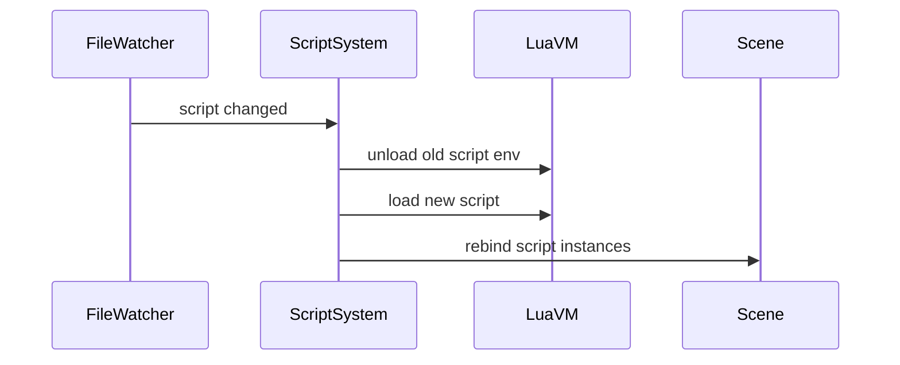

Hot reload should be disabled or limited in release builds.

---

## 14. Game Project Structure

Each game should live under `/games`.

Example:

```text
/games/my_rpg
  /assets
    /characters
    /tilesets
    /audio
    /ui
  /scripts
    /player.lua
    /npc
    /events
  /scenes
    /starter_town.scene.json
  /src
    main.cpp
  CMakeLists.txt
```

### 14.1 Game Entry Point

The game executable should be thin.

Example responsibility:

```cpp
int main(int argc, char** argv)
{
    Engine::Runtime::Application app;

    app.Configure({
        .title = "My RPG",
        .windowWidth = 1280,
        .windowHeight = 720,
        .initialScene = "scenes/starter_town.scene.json"
    });

    return app.Run();
}
```

The game entry point configures the engine but does not reimplement the engine loop.

---

## 15. Runtime Data Flow

The runtime loads project files, initializes systems, and enters the game loop.

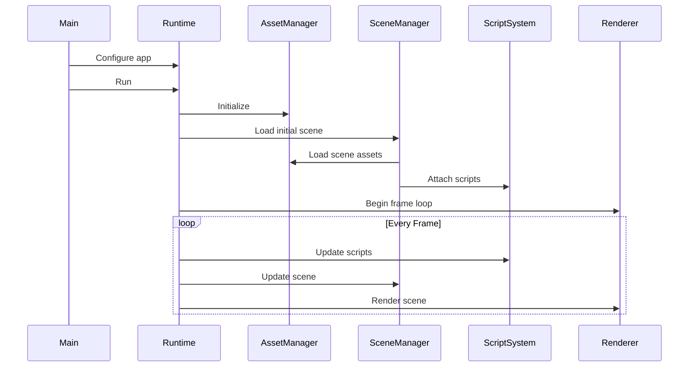

---

## 16. Editor Data Flow

The editor loads scene data, allows modifications, and saves the scene back to disk.

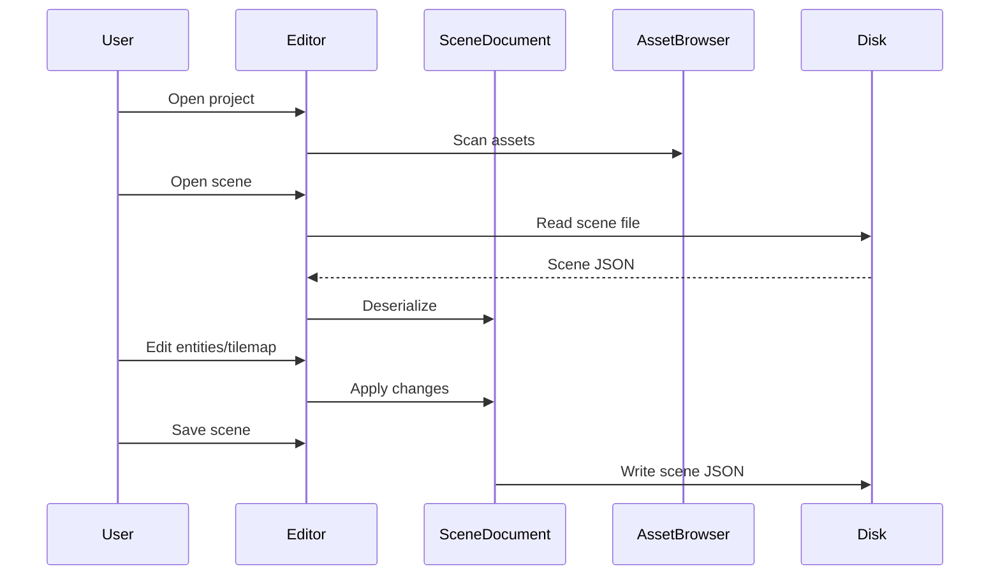

---

## 17. Asset Pipeline

### 17.1 Early Development

During early development, assets can be loaded directly from folders.

```text
/assets/characters/player.png
/assets/audio/theme.ogg
/assets/scripts/player.lua
```

This keeps iteration fast.

### 17.2 Later Development

Later, add an asset packer.

The asset packer can:

* Validate assets
* Copy assets to a build folder
* Generate asset manifests
* Optionally pack assets into archives

### 17.3 Asset Manifest

Example:

```json
{
  "version": 1,
  "assets": [
    {
      "id": "player_sprite",
      "type": "texture",
      "path": "characters/player.png"
    },
    {
      "id": "field_theme",
      "type": "music",
      "path": "audio/field_theme.ogg"
    }
  ]
}
```

### 17.4 Asset Pipeline Diagram

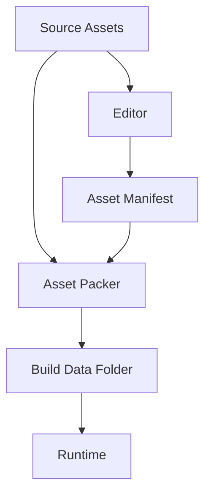

---

## 18. Packaging and Distribution

The shipped game should be distributed as a self-contained folder.

Example Windows package:

```text
/MyRpg-Windows
  MyRpg.exe
  data/
  SDL2.dll
  OpenAL32.dll
  steam_api64.dll
```

Example Linux package:

```text
/MyRpg-Linux
  MyRpg
  data/
  libSDL2.so
  libsteam_api.so
```

### 18.1 Steam Considerations

The engine should support:

* Stable save path
* Config path outside install directory
* Controller input eventually
* Steamworks integration as optional game-level module
* Per-platform build artifacts

### 18.2 Save Data Location

Do not write save files into the install directory.

Use platform-appropriate user paths:

```text
Windows: %APPDATA%/GameName/
Linux: ~/.local/share/GameName/
```

---

## 19. Testing Strategy

Testing should focus on stable systems.

### 19.1 Good Test Candidates

* Scene serialization
* Asset path resolution
* Input mapping
* Tile collision
* Lua API behavior
* Save/load logic
* CMake target boundaries

### 19.2 Less Useful Early Tests

Avoid over-testing:

* Rendering pixel output
* ImGui UI layout
* Tiny getters/setters

### 19.3 Test Layout

```text
/tests
  /core
  /assets
  /scene
  /scripting
```

### 19.4 Example Tests

```text
SceneSerializer_LoadsSceneWithEntities
TileCollision_BlocksMovementIntoSolidTile
InputMap_MapsKeyboardKeyToAction
LuaScript_CallsOnCreateWhenAttached
```

---

## 20. Logging and Diagnostics

The engine should have good diagnostics from the start.

### 20.1 Logging Categories

```text
Core
Render
Assets
Scene
Input
Audio
Scripting
Editor
Runtime
```

### 20.2 Example Log Output

```text
[Assets] Loaded texture: assets/characters/player.png
[Scene] Loaded scene: starter_town.scene.json
[Scripting] Attached script: scripts/player.lua to entity Player
[Render] Frame time: 16.6ms
```

### 20.3 Error Strategy

Use explicit results for recoverable errors.

Avoid throwing exceptions across module boundaries unless you intentionally choose an exception-based style.

Example:

```cpp
Result<Scene> LoadScene(const std::filesystem::path& path);
```

---

## 21. Generated Art Workflow

Because the primary developer is not an artist, the engine/game workflow should support generated and placeholder art.

### 21.1 Recommended Art Strategy

Use a hybrid strategy:

1. Generated placeholder assets
2. Free/open asset packs
3. Commissioned or custom final assets later

### 21.2 Art Style Bible

Create a document:

```text
/docs/ART_STYLE_GUIDE.md
```

It should define:

* Resolution
* Color palette direction
* Character proportions
* Tile size
* UI style
* Portrait style
* Mood references

### 21.3 Starter Asset Types

Generate or collect:

* Player sprite
* NPC sprites
* 16x16 or 32x32 tileset
* Dialogue box frame
* UI icons
* Portrait placeholders
* Simple sound effects

### 21.4 Important Warning

Generated art can be useful for prototyping, but consistency is difficult.

For a serious release, generated art should either be heavily curated or replaced with a consistent final asset set.

---

## 22. Development Roadmap

The engine should be developed through vertical slices.

Each milestone should improve both the engine and the actual game.

### Milestone 0 — Project Bootstrap

Goals:

* CMake project builds
* Engine targets exist
* Game executable exists
* Editor executable exists
* SDL window opens

Deliverable:

```text
A window opens on Windows/Linux.
```

---

### Milestone 1 — Sprite Rendering

Goals:

* Load texture
* Draw sprite
* Add camera
* Handle resizing/scaling

Deliverable:

```text
Player sprite renders in a blank scene.
```

---

### Milestone 2 — Input and Movement

Goals:

* Input action mapping
* Move player
* Basic delta time

Deliverable:

```text
Player moves around with keyboard.
```

---

### Milestone 2.5 — Sprite Animation

Inserted after M2 shipped revealed that a static down-facing sprite while
walking in any direction reads as broken. Closes the gap before tilemap
work begins. Numbering stops at 2.5 — M3–M10 are unchanged.

Goals:

* Standalone `AnimatedSprite` primitive in `engine_render` (named clips,
  frame-duration-driven Update, looping vs one-shot, Play/Pause/Resume)
* Directional sprite swap (4 cardinal facings)
* Walk-cycle animation (3 frames per direction, ~8 fps)
* `AnimatedSpriteComponent` (DesignDoc §7.7) wraps the same primitive
  when the scene system lands

Deliverable:

```text
Iden faces the direction of travel. Walk cycle plays while moving,
idle frame when standing.
```

---

### Milestone 3 — Tilemap and Collision

Goals:

* Load tilemap
* Render map
* Add solid tiles
* Prevent walking through walls

Deliverable:

```text
Player walks around a small map and collides with walls.
```

---

### Milestone 4 — Scene Format

Goals:

* JSON scene files
* Entity loading
* Components loaded from scene

Deliverable:

```text
Game loads starter_town.scene.json.
```

---

### Milestone 5 — Editor v1

Goals:

* Open scene
* Save scene
* Edit entities
* Paint tilemap

Deliverable:

```text
Developer can edit a room and load it in-game.
```

---

### Milestone 6 — Lua Scripting

Goals:

* Embed Lua
* Attach scripts to entities
* Call OnCreate and OnUpdate
* Bind basic APIs

Deliverable:

```text
NPC behavior is implemented in Lua.
```

---

### Milestone 7 — Dialogue and Interaction

Goals:

* Interactable entities
* Dialogue UI
* Lua-triggered dialogue

Deliverable:

```text
Player talks to an NPC.
```

---

### Milestone 8 — Save System

Goals:

* Save file path
* Store flags
* Store player position
* Store inventory state

Deliverable:

```text
Game state persists after restart.
```

---

### Milestone 9 — Packaging

Goals:

* Release build
* Copy assets
* Build distributable folder
* Launch outside dev environment

Deliverable:

```text
A friend can download and run the game.
```

---

### Milestone 10 — Steam Prep

Goals:

* Stable app folder
* Controller support
* Steamworks optional integration
* Release checklist

Deliverable:

```text
Game is ready for Steamworks onboarding and store packaging.
```

---

## 23. Documentation Strategy

Because this project will likely be developed with help from AI tools, documentation should be treated as part of the architecture.

### 23.1 Core Docs

Maintain:

```text
/docs/SYSTEM_DESIGN.md
/docs/ENGINE_RULES.md
/docs/BUILD_SYSTEM.md
/docs/SCRIPTING_API.md
/docs/SCENE_FORMAT.md
/docs/ART_STYLE_GUIDE.md
/docs/LLM_BOOTSTRAP.md
```

### 23.2 LLM Bootstrap File

`LLM_BOOTSTRAP.md` should contain the short version of the architecture and rules.

It should be pasted into AI tools when beginning new work.

### 23.3 Update Rule

When a system changes, update the docs in the same commit.

Example:

```text
Add Lua script component

- Add ScriptComponent
- Add script loading
- Update SCRIPTING_API.md
- Update SYSTEM_DESIGN.md
```

---

## 24. Architectural Guardrails

These rules should be enforced throughout development.

### 24.1 Hard Rules

* Engine cannot depend on game.
* Engine cannot depend on editor.
* Editor cannot be required for runtime.
* Lua cannot mutate engine internals directly.
* Scene data must be serializable.
* Game logic belongs in Lua unless there is a strong reason to write C++.
* Runtime must run without development tools.

### 24.2 Soft Rules

* Prefer simple systems before abstract systems.
* Build vertical slices.
* Avoid premature optimization.
* Avoid generic engine features unless the game needs them.
* Prefer readable data formats early.
* Prefer boring dependencies.

---

## 25. Risks and Mitigations

### Risk: Editor scope explodes

Mitigation:

Build only scene editing, tile painting, and component editing first.

Avoid play-in-editor until the runtime/editor boundary is mature.

---

### Risk: Rendering architecture becomes too abstract too early

Mitigation:

Start with SDL rendering or one concrete backend.

Introduce abstraction only when needed.

---

### Risk: Lua bindings become unsafe or chaotic

Mitigation:

Expose only curated APIs.

Document every Lua binding.

Do not bind raw internal systems freely.

---

### Risk: Game development stalls while engine grows

Mitigation:

Every milestone must produce a visible game improvement.

No engine-only work for long stretches unless absolutely necessary.

---

### Risk: Generated art lacks consistency

Mitigation:

Create an art style guide early.

Use generated assets as prototypes.

Replace or curate final art before release.

---

## 26. Recommended Initial Tech Stack

### Language

```text
C++20
Lua
```

### Build

```text
CMake
CMakePresets.json
Ninja or platform default generator
```

### Window/Input/Audio

```text
SDL2 or SDL3
```

### Editor UI

```text
Dear ImGui
```

### Serialization

```text
JSON for development
Optional binary or packed format later
```

### Testing

```text
Catch2 or GoogleTest
```

### Packaging

```text
CMake install rules
Custom packaging scripts
Steamworks later
```

---

## 27. Final Target Architecture

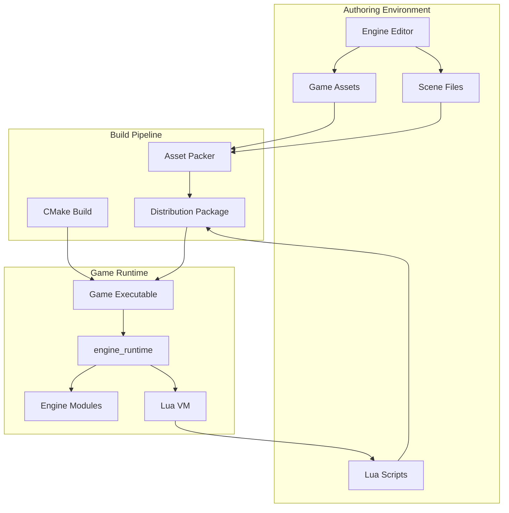

---

## 28. Success Criteria

The engine is successful when:

* A full game can be built with it.
* Scenes can be edited visually.
* Gameplay can be scripted in Lua.
* The game can be packaged for Windows and Linux.
* The runtime does not depend on the editor.
* The engine can be reused for another 2D RPG project.
* Another developer can understand the project from the docs.
* AI tools can be given the docs and produce architecture-aligned suggestions.

---

## 29. Suggested Next Step

The next step is to create the initial repository scaffold with:

```text
CMakeLists.txt
CMakePresets.json
/src/core
/src/runtime
/src/editor
/games/my_rpg
/docs/SYSTEM_DESIGN.md
```

The first implementation goal should be:

```text
Open a cross-platform window from game_my_rpg using engine_runtime.
```

That gives the project a real executable and establishes the foundation for every future milestone.

---

## 30. Concurrent Game Development

The engine is not built in a vacuum. A specific 2D RPG (`games/my_rpg/`) is developed in lockstep with the engine, and the relationship between the two is enforced — not aspirational.

### 30.1 Two Documents, Two Owners

* `docs/DesignDoc.md` (this document) — the **engine** architecture. Owned collectively by the engineering agents.
* `docs/GameDesign.md` — the **game** being built. Owned by the Game Director agent. Defines the working title, theme, characters, world, tone, and v1 scope.

The two evolve independently but inform each other: the game's design constrains which engine features are actually needed; the engine's capabilities constrain which game ideas are reachable in v1.

### 30.2 The Milestone Contract

Per §22, every engine milestone produces a *visible game improvement*. `docs/GameDesign.md` §9 maps each engine milestone to the specific game deliverable it unlocks. This contract is enforced two ways:

* A milestone is not "done" until both halves ship — the engine capability AND the game scene/script/feature that exercises it.
* If the game falls behind, engine work pauses until it catches up. The mitigation for §25's "engine grows while game stalls" risk is procedural, not aspirational.

### 30.3 Engine Capability Demand

New engine features are justified by game need, not by engineering ambition.

* The Game Director files a request: "the slice needs X to land moment Y." (See `.claude/agents/game-director.md` §"Don't Direct The Engine — Request From It.")
* The Game Engine Programmer scopes the smallest engine change that delivers X.
* If no game moment demands a feature, it does not ship in v1, no matter how clean or general the design.

### 30.4 Playtests Drive Roadmap

After M7 ships the first playable conversation, the slice is playtested with strangers (per `GameDesign.md` §4 and the Game Director's Phase 4 workflow). Findings from playtests can reprioritize remaining milestones — e.g. defer M9 packaging if M7's dialogue pacing needs a second iteration. Engine progress without playtest validation past M7 is a risk flag.

### 30.5 What This Means For Each Module

| Module           | Concurrent-dev consequence                                                                 |
| ---------------- | ------------------------------------------------------------------------------------------ |
| `engine_render`  | First sprite shipped is the game's player sprite, not a placeholder square                 |
| `engine_input`   | First action map is the game's actual control scheme, not generic WASD demo                |
| `engine_scene`   | First scene loaded is `starter_town.scene.json`, not a fixture                              |
| `engine_scripting` | First Lua script is a real NPC, not "hello world"                                          |
| `engine_audio`   | First sounds wired are the game's actual SFX, even if placeholder-quality                    |
| `engine_editor`  | First editor session opens the real `starter_town` and produces a real save                 |

Generic demos are allowed during development, but they are never the "deliverable" for a milestone. The game is.
